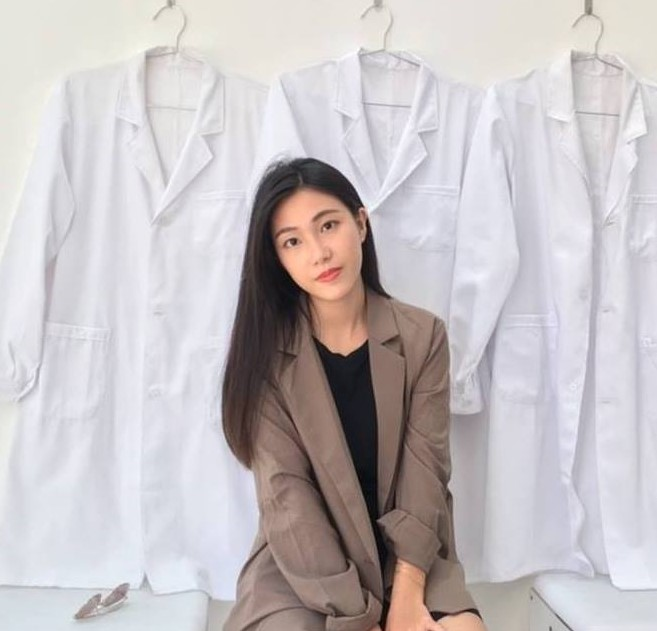

<!DOCTYPE html>
<html lang="en">

<head>
    <meta charset="utf-8" />
    <meta name="viewport" content="width=device-width, initial-scale=1, shrink-to-fit=no" />
    <meta name="description" content="Yusha's CV" />
    <meta name="author" content="Yusha" />
    <title>Yusha's Resume</title>
    <link rel="icon" type="image/x-icon" href="assets/img/favicon.ico" />
    <!-- Font Awesome icons (free version)-->
    
    <!-- Google fonts-->
    <link href="https://fonts.googleapis.com/css?family=Saira+Extra+Condensed:500,700" rel="stylesheet"
        type="text/css" />
    <link href="https://fonts.googleapis.com/css?family=Muli:400,400i,800,800i" rel="stylesheet" type="text/css" />
    <!-- Core theme CSS (includes Bootstrap)-->
    <link href="css/styles.css" rel="stylesheet" />

</head>

<body id="page-top">
    <!-- Navigation-->
    <nav class="navbar navbar-expand-lg navbar-dark bg-primary fixed-top" id="sideNav">
        <a class="navbar-brand js-scroll-trigger" href="#page-top">WeiHsin
                Cheng</a><button class="navbar-toggler" type="button" data-toggle="collapse"
            data-target="#navbarSupportedContent" aria-controls="navbarSupportedContent" aria-expanded="false"
            aria-label="Toggle navigation"></button>
        

            <ul class="navbar-nav">
                <li class="nav-item"><a class="nav-link js-scroll-trigger" href="#about">About</a></li>
                <li class="nav-item"><a class="nav-link js-scroll-trigger" href="#strength">Strength</a></li>
                <li class="nav-item"><a class="nav-link js-scroll-trigger" href="#experience">Experience</a></li>
                <li class="nav-item"><a class="nav-link js-scroll-trigger" href="#education">Education</a></li>
                <li class="nav-item"><a class="nav-link js-scroll-trigger" href="#extracurricular">Extracurricular</a>
                </li>
                <li class="nav-item"><a class="nav-link js-scroll-trigger" href="#collection">Collection</a></li>
            </ul>
        

    </nav>

    <!-- Page Content-->
    

        <!-- About-->
        <section class="resume-section" id="about">
            

                <h1 class="mb-0">WeiHsin Cheng</h1>
                
Taipei · 0952-969-257 · <a
                        href="mailto:b06302361@ntu.edu.tw">b06302361@ntu.edu.tw</a>

                

                    Student of National Taiwan University, major in Political Science.
                    I like to catch up with the latest trend, especially the fields of technology, fashion, life-style
                    changing. I love to learn new things. I am now taking courses of MKT big data and python.
                    I can adapt well to the environment of multiple projects, but still emphasize responsibility,
                    quality and efficiency

                

                    <a class="social-icon" href="https://yushac.github.io/CV/"><i class="fab fa-github"></i></a><a
                        class="social-icon"
                        href="https://www.facebook.com/profile.php?id=100000317275873&ref=bookmarks"><i
                            class="fab fa-facebook-f"></i></a>
                

            

        </section>
        

        <!-- Strength-->
        <section class="resume-section" id="strength">
            

                <h2 class="mb-5">Strength</h2>
                
Presentation

                <ul class="fa-ul mb-0">
                    <li>
                        <i class="fas fa-check"></i>1st of NTU Presentation Contest
                    </li>
                    <li>
                        <i class="fas fa-check"></i>Recommended Speaker of Youth
                        Development
                        Administration, MOE
                    </li>
                </ul>
                
Languages

                <ul class="fa-ul mb-0">
                    <li>
                        <i class="fas fa-check"></i>Chinese, Minnam (Native)
                    </li>
                    <li>
                        <i class="fas fa-check"></i>English (Fluent, TOEIC 955)
                    </li>
                    <li>
                        <i class="fas fa-check"></i>Spanish (Conversant)
                    </li>
                </ul>
                
Presentation

                <ul class="fa-ul mb-0">
                    <li>
                        <i class="fas fa-check"></i>MS office
                    </li>
                    <li>
                        <i class="fas fa-check"></i>Marketing, Branding
                    </li>
                    <li>
                        <i class="fas fa-check"></i>Project Management
                    </li>
                </ul>
            

        </section>
        

        <!-- Experience-->
        <section class="resume-section" id="experience">
            

                <h2 class="mb-5">Experience</h2>
                

                    

                        <h3 class="mb-0">Protocol dept., Ministry of Foreign Affairs</h3>
                        
PT

                        <ul>
                            <li>Executed, and supported a wide range of ceremonial and official functions hosted by the
                                President, Vice President, Minister of Foreign Affairs, and other high-ranking
                                Government
                                officials</li>
                            <li>Organized the participation of the Diplomatic Corps in special events and official
                                public
                                events</li>
                        </ul>
                    

                    
Jun 2019 - Present

                

                

                    

                        <h3 class="mb-0">Apply Consultancy</h3>
                        
Consultant

                        <ul>
                            <li>Consultant of EMBA application, assisting in polishing autobiography and professional
                                experience</li>
                            <li>Exposure to diverse industries, covering department stores, preschool education,
                                finance, food, etc.</li>
                        </ul>
                    

                    
Oct 2019 - Present

                

                

                    

                        <h3 class="mb-0">SEMICON Taiwan</h3>
                        
PA

                        <ul>
                            <li>Responsible for the overall preparation of several forums </li>
                            <li>Contacted speakers, communicated between SEMI and speakers</li>
                            <li>Management and coordination of on-site personnel</li>
                        </ul>
                    

                    
2018 , 2019

                

                

                    

                        <h3 class="mb-0">Dept of Biomedical Engineering, NCKU</h3>
                        
RA

                        <ul>
                            <li>Topics: (1) Market development dilemma of medical equipment manufacturers
                                in STSP (2) Medical big data</li>
                            <li>Researched and Analyzed business model of medical equipment manufacturers</li>
                            <li>Design interview program and participate in interviews medical equipment manufacturers
                                and users</li>
                            <li>Assist in research papers collection and translation</li>
                        </ul>
                         
                         
                         
                    

                    
Jul - Sept 2016

                

                

                    

                        
                    

                    

                        <h5 class="mt-5">Protocol dept., MOFA</h5>
                        
The highest protocol unit in Taiwan. Our work represents the country, one mistake could
                            affect our national friendship, thus I was trained to pay attention to etiquette, detail and
                            precise working attitude. In the 21-gun salute for Nauru president, I was standing after our
                            president Tasi.
                        

                    

                

                

                    

                        <h5 class="mt-5">SEMICON Taiwan</h5>
                        
The second largest semiconductor exhibition in the world, including 21 international forums,
                            700+ exhibitors and 2,000+ booths participated, attracting 50,000+ visitors on average.
                            Participants included Executive dean William Lai, TSMC founder Morris Chang and Chairman
                            Mark Liu, ASE President & CEO Tien Wu and other opinion leaders. Also experts from
                            world-class R&D institutions.
                        

                    

                    

                        
                    

                

                

                    

                        
                    

                    

                        <h5 class="mt-5">Dept of Biomedical Engineering, NCKU</h5>
                        
At that time, the national policy focus on the development of the biomedical industry. Thus
                            we
                            carry
                            out the research case of the Ministry of Science and Technology, tried to figure out the
                            dilemma
                            and
                            solution to its development.
                        

                    

                

            

        </section>
        

        <!-- Education-->
        <section class="resume-section" id="education">
            

                <h2 class="mb-5">Education</h2>
                

                    

                        <h3 class="mb-0">National Taiwan University (NTU)</h3>
                        
Political Science | Bachelor

                        
Top-rank university in Taiwan, enrolled as Top 3 in the entrance exam

                    

                    
2018 - 2021

                

                

                    

                        <h3 class="mb-0">Wenzao Ursuline University of Languages (WZU)</h3>
                        
 Spanish | Associate bachelor 

                        
Only one language university in Taiwan, graduated with GPA 4.0 and times of scholarship of
                            outstanding extracurricular performance

                    

                    
2013 - 2018

                

            

        </section>
        

        <!-- Extracurricular Experience-->
        <section class="resume-section" id="extracurricular">
            

                <h2 class="mb-5">Extracurricular Experience</h2>
                

                    

                        <h3 class="mb-0">NTU</h3>
                        
Student Representative

                        <ul>
                            <li>Focus on academic affairs: elected as the chairwoman of the Academic Affairs Committee
                                and
                                Student Representative of the school-level curriculum committee</li>
                            <li>Participated in the project of Youbike 2.0, and initiated the project of improving the
                                anti-skid measures of parking lots</li>
                        </ul>
                    

                    
Jun 2019 - Present

                

                

                    

                        <h3 class="mb-0">Global International Symposium 2019</h3>
                        
Organizer

                        <ul>
                            <li>Instructed by NTU, the largest domestic academic student forum, and top-rank in Asia
                            </li>
                            <li>Responsible for international partnership, organizing overseas sessions, English hosting
                                during the symposium</li>
                            <li>Speakers of GIS: General Manager of Mercedes-Benz, Director of Technical Cooperation of
                                Google Asia Pacific, Nobel Prize winner Mr. Yuanzhe Li, Taipei Mayor Wenzhe Ke</li>
                        </ul>
                    

                    
Aug 2017 - Jul 2018

                

                

                    

                        <h3 class="mb-0">WZU</h3>
                        
Student Speaker 

                        <ul>
                            <li>Also student representatives at school-level meeting, such as meeting of school affairs,
                                student affairs, academic affairs</li>
                            <li>Won: Legislative Distinguished Award of National College Students' Achievement Contest
                            </li>
                            <li>Actively participated in the National Association Parliamentarians as the WZU Speaker,
                                organized conference and lecturing rules of procedure</li>
                        </ul>
                    

                    
Sept 2016 - Aug 2017

                

                

                    

                        <h3 class="mb-0">Universitas Indonesia</h3>
                        
Volunteer

                        <ul>
                            <li>At the age of 17, as the only Taiwanese, work with 16 foreigners from 13 other countries
                            </li>
                            <li>Taught English to underprivileged students, affecting 100+ Indonesian students</li>
                        </ul>
                    

                    
Jul - Sept 2015

                

                

                    

                        <h3 class="mb-0">AIESEC</h3>
                        
Branding Manager

                        <ul>
                            <li>Lectured marketing and branding knowledge to project teams, an average of 2.5 sessions
                                per
                                month</li>
                            <li>Organized 25 briefing sessions with an average of 70 participants, and 2 PR events with
                                approximately 1,000 participants</li>
                            <li>Organized two one-week English camps in junior high schools, with 60+ delegates</li>
                            <li>As vice-chairman, organized two two-day national conferences, with 200 delegates from
                                university</li>
                            <li>Member of the national marketing team, responsible for the recruitment marketing
                                strategy
                                of all branches in Taiwan (18 branches penetrate 120+ schools)</li>
                        </ul>
                    

                    
Mar 2014 - Feb 2016

                

            

        </section>
        

        <!-- Collection-->
        <section class="resume-section" id="collection">
            

                <h2 class="mb-5">Collection</h2>
                

                    

                        <h3 class="mb-0"> Presentation</h3>
                        

                            

                                
7th NTU presentation Contest Champion   from 100+
                                    participants
                                

                                
                            

                            

                                
Recommended Speaker of Youth Development Administration, 
                                    Ministry of Education
                                

                                
                            

                        

                    

                    

                        <h3 class="mb-0"> Event planning and management</h3>
                        

                            

                                
Organized PR event as AIESEC MarCom Branding Mgr., 
                                    engaged with 1000+ TA
                                

                                
                            

                            

                                
Organized diverse events as Student Speaker,  with 90%+
                                    satisfied feedback on average
                                

                                
                            

                        

                        

                            <h3 class="mb-0"> International Volunteering</h3>
                            

                                

                                    
My children when volunteering in Indonesia
                                    

                                    
                                

                                

                                    
With them I learnt global perspectives
                                    

                                    
                                

                            

                        

                    

                

            

        </section>
    

    <!-- Bootstrap core JS-->
    
    
    <!-- Third party plugin JS-->
    
    <!-- Core theme JS-->
    
</body>

</html>
