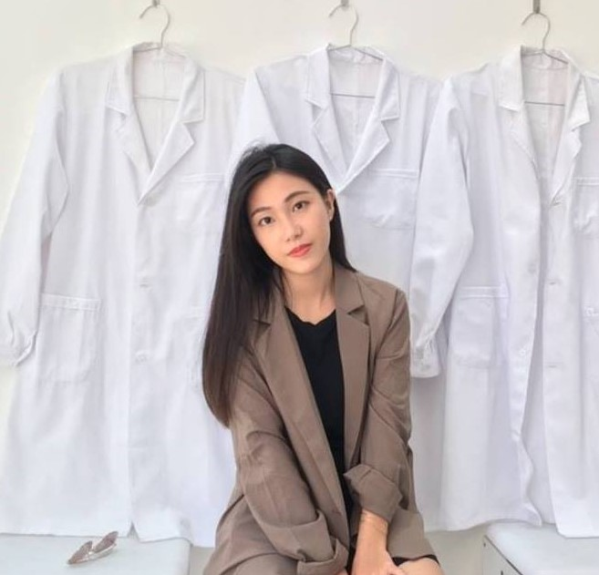

<!DOCTYPE html>
<html lang="zh-TW">

<head>
	<title>Yusha</title>

	<!-- Meta -->
	<meta charset="utf-8">
	<meta http-equiv="X-UA-Compatible" content="IE=edge">
	<meta name="viewport" content="width=device-width, initial-scale=1.0">

	<!-- FontAwesome JS-->
	

	<!-- Theme CSS -->
	<link id="theme-style" rel="stylesheet" href="hw3/theme-2.css">

	

</head>

<body>

	<header class="header text-center">
		<h1 class="blog-name pt-lg-4 mb-0"><a href="index.html">Hi I'm Yusha </a></h1>

		<nav class="navbar navbar-expand-lg navbar-dark">

			<button class="navbar-toggler" type="button" data-toggle="collapse" data-target="#navigation"
				aria-controls="navigation" aria-expanded="false" aria-label="Toggle navigation">
				
			</button>

			

				

					

					
Student of National Taiwan University, major in Political Science.
						

						
b06302361@ntu.edu.tw

					

					<!--//bio-->

					<ul class="social-list list-inline py-3 mx-auto">
						<li class="list-inline-item"><a
								href="https://www.facebook.com/profile.php?id=100000317275873&ref=bookmarks"><i
									class="fab fa-facebook fa-fw"></i></a></li>
						<li class="list-inline-item"><a href="#"><i class="fab fa-line fa-fw"></i></a></li>
					</ul>
					<!--//social-list-->
					

				

			

		</nav>
	</header>

	

		<article class="about-section py-5">
			

				<h2 class="title mb-3">About Me</h2>

				
臺大政治大三，文藻外大五專部西班牙文科畢業生。熱愛時尚、科技、生活型態等各域的新潮趨勢。
					喜歡充實自我，目前正在學習大數據行銷分析與程式語言。能良好適應多重專案的環境，但仍講求責任、品質與效率。
					我相信努力，人一能之，己百之；人十能之，己千之。

				

					

						<h5 class="title mb-3"><b>溝通表達</b></h5>
						

						<ul>
							<li>台大盃簡報大賽
								 2019年冠軍</li>
							<li>教育部青年發展署
								 推薦講師</li>
							<li>波蘭市長在台期間秘書</li>
						</ul>
					

					

						<h5 class="title mb-3"><b>語言能力</b></h5>
						

						<ul>
							<li>Chinese, Minnam 
								(Native)</li>
							<li>English  
								(Fluent, TOEIC 955)</li>
							<li>Spanish (Conversant)</li>
						</ul>
					

					

						<h5 class="title mb-3"><b>專業技能</b></h5>
						

						<ul>
							<li>MS office</li>
							<li>Python</li>
							<li>前端程式設計</li>
							<li>專案管理、活動企劃執行</li>
							<li>數位行銷、品牌形象管理</li>
						</ul>
					

				

				

				<h2 class="title mb-3">工作經驗</h2>
				

					

						<h5 class="mt-5">外交部禮賓處 | 工讀生 | 2019 年 6 月 - 至今</h5>
						

							<ul>
								<li>籌辦國家級重要典禮（國慶大典、總統就職典禮、軍禮）</li>
								<li>禮賓接待國家級貴賓（友國元首與重要官員）</li>
								<li>聯繫重要人士（五院首長、駐台大使與代表）</li>
							</ul>

							<h5 class="mt-5"><b>愛普倈顧問 ｜ 書審顧問 | 2018年 10月 - 至今</h5>
							<ul>
								<li>全台各大學在職專班EMBA書審顧問與代寫</li>
								<li>接觸產業多元，遍及百貨、幼教、金融、食品等</li>
							</ul>
							<h5 class="mt-5">SEMICON&nbsp; Taiwan 國際半導體展 | 專案人員 |2018 年、2019 年</h5>
							<ul>
								<li>負責數場論壇之整體籌備工作 </li>
								<li>聯繫國內外論壇講師</li>
								<li>管理與協調會展現場人員</li>
							</ul>
							<h5 class="mt-5">成大生物醫學工程系 | 研究助理 | 2016 年 7月 - 9月</h5>
							<ul>
								<li>研究主題有二：(1) 研究南科醫療器材廠商之市場發展困境
											(2)&nbsp;醫療巨量(Medical big data)</li>
								<li>各家廠商之商業研究與剖析，設計訪綱並參與訪談</li>
								<li>協助研究相關文獻蒐集與翻譯</li>
							</ul>
							<h5 class="mt-5">居家醫療 | 工讀生 | 2016 年3月 - 2018年 2月</h5>
							<ul>
								<li>門市經營、顧客服務、醫療器材介紹</li>
							</ul>

						

					

					<h5 class="mt-5">外交部禮賓處</h5>
					
我國最高之禮賓單位，除了負責國家重要典禮，也經常聯繫國家重要人士。
						由於工作內容皆代表著國家，一旦失誤，可能影響我國的邦誼，因此培養我注重禮節、細節與精準的工作態度。
					

					<figure></figure>

					<h5 class="mt-5">SEMICON 國際半導體展</h5>
					
全球第二大半導體展，包含21 場國際級論壇， 以及超過 700 家展商及逾2千個攤位參展，平均吸引超過 50,000 參展者。
						出席人士包含行政院長賴清德、台積電創辦人張忠謀、董事長劉德音、廣達電腦董事長林百里、日月光總經理暨執行長吳田玉等意見領袖。
					

					<figure></figure>

					<h5 class="mt-5">成大生物醫學工程系</h5>
					
隸屬陳芃婷老師研究團隊。在當時臺灣發展生醫產業的政策方向下，進行科技部的研究案。
						程中學到的簡報、商業剖析、訪談、研究技巧等，甚至是大量閱讀期刊所得到的知識，都對我的未來造成極大且全方面的助益，運用在各領域的學習之上。
					

					<figure></figure>

				

		</article>
		<!--//about-section-->

	

	<!--//main-wrapper-->

	<!-- Javascript -->
	
	
	

	<!-- Footer -->
	<footer id="footer" class="footer section">
		

			

				

					

						
© 2020 Thank you! 

					

				

			

		

	</footer>
	<!--/ End Footer -->

</body>

</html>
